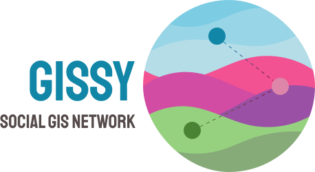

<h1 align="center">



</h1>

- [Project Info](https://docs.google.com/document/d/13jBvjWZJGnerSwUwTJ4TDnX-6lxB2-N4us-v--1UHHo/edit?usp=sharing)
- Bootstrapped from [`grand-stack-stater`](https://github.com/grand-stack/grand-stack-starter)

## Deployments

- [Neo4j](https://10-0-1-104-35408.neo4jsandbox.com/browser/)
- [GraphQL Server](https://core.dennisvash.now.sh/graphql)
- [△ now](https://zeit.co/gissy)

## Quick Start

1. Install Dependencies

   ```sh
   yarn install
   ```

2. Development

   ```sh
   yarn develop
   # Run for seeding the Neo4j DB
   yarn seed
   ```

3. Deployment

   ```sh
   npm i -g now
   now login
   now
   ```

   [](https://deploy.now.sh/?repo=https://github.com/social-gissy-network/core&env=NEO4J_USER&env=NEO4J_URI&env=NEO4J_PASSWORD)
